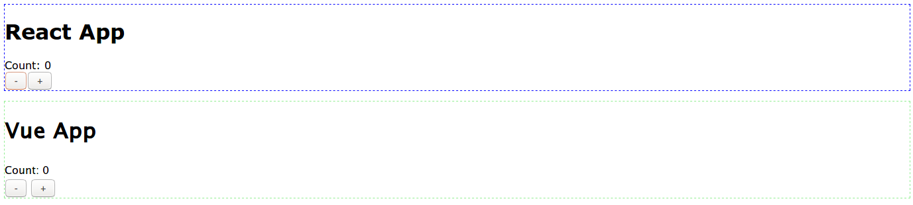

# react-vue

> Um exemplo de setup Webpack com React e Vue



### Instalar as dependências

`npm install`

### Para rodar o servidor de desenvolvimento

```
npm run dev
```

### Build

Desenvolvimento:

```
npm run build:dev
```

Produção:

```
npm run build:prod
```

### Ideias futuras

- Separar os bundles (um para cada framework)
- Extrair os CSS com o mini-css-extract-plugin
